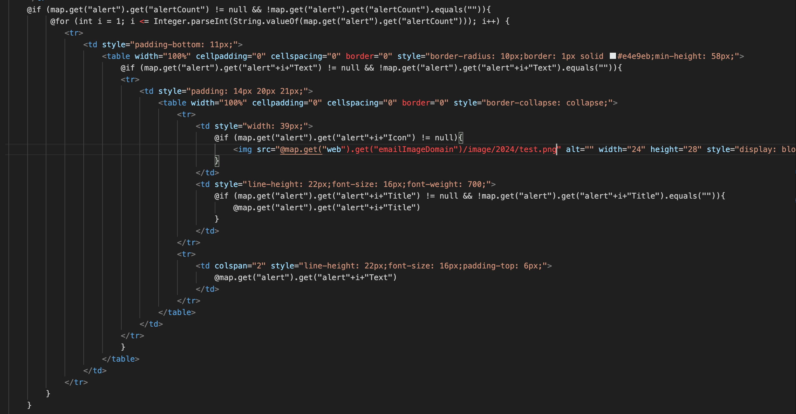
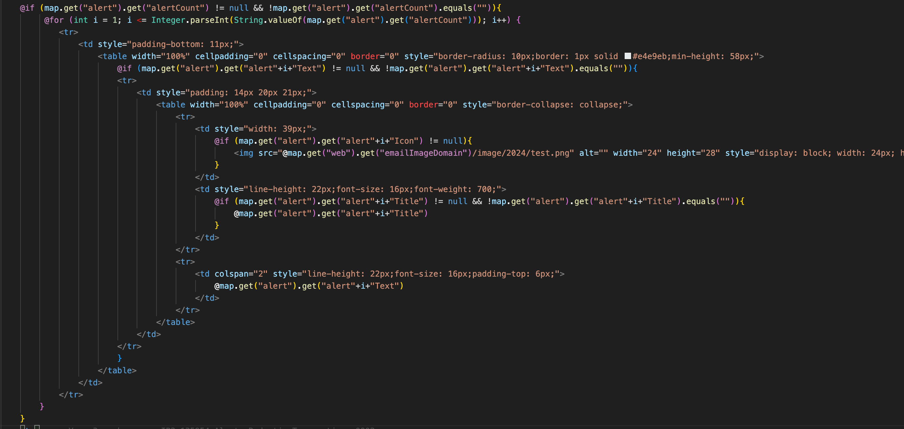
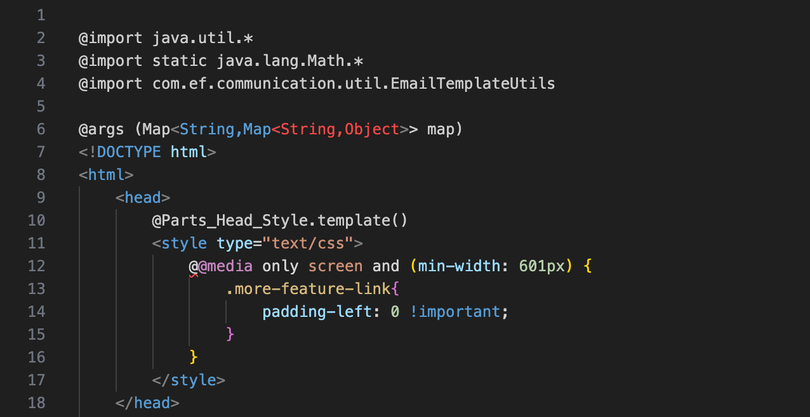
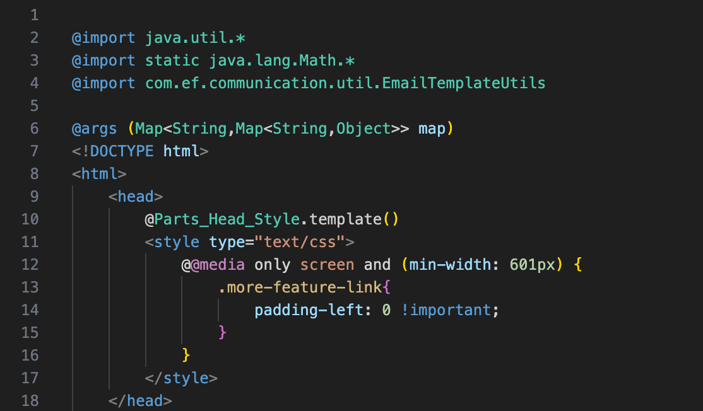
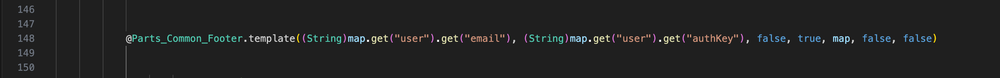
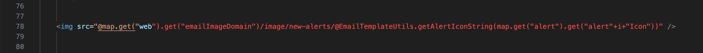
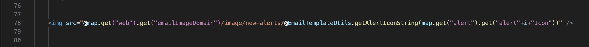

# Rocker Template Syntax Highlight

Syntax highlighting for [Rocker](https://github.com/fizzed/rocker) `.rocker.html` template files — a Java-based, statically typed templating engine.

## Features

- **Control flow** — `@if`, `@else if`, `@else`, `@for`, `@while`, `@with` highlighted as keywords
- **Expressions** — `@variable`, `@object.method()`, `@Class.staticMethod()` with dot-chain coloring
- **Template calls** — `@Template.template(args)` with full argument highlighting
- **Declarations** — `@args` type signatures with generic support (`Map<String, Object>`)
- **Imports** — `@import` statements
- **Java literals** — strings, numbers, `true` / `false` / `null`, primitive types
- **Operators** — `!=`, `==`, `&&`, `||`, `++`, `--`, `+`, and comparison operators
- **Block delimiters** — `{` and `}` visually distinct from surrounding HTML
- **Injection grammar** — Rocker expressions inside HTML attribute values are highlighted correctly, including deeply nested calls like `@Util.method(map.get("key"+"suffix"))`
- **Light & dark theme support** — color rules adapt to both light and dark VS Code themes

## Preview

**Example 1 — Control flow & nested expressions:**

| Before                                | After                               |
| ------------------------------------- | ----------------------------------- |
|  |  |

`@if`, `@for` keywords, chained method calls like `map.get("alert").get("alertCount")`,
operators, and block delimiters `{` `}` highlighted alongside standard HTML tags.

**Example 2 — File header: imports, args & template calls:**

| Before                                | After                               |
| ------------------------------------- | ----------------------------------- |
|  |  |

`@import` statements, `@args` with nested Java generic types (`Map<String,Map<String,Object>>`),
`@Template.template()` calls, and `@@` escape sequence — all distinct from surrounding HTML and CSS.

**Example 3 — Complex template call with type casts & chained arguments:**

| Before                                | After                               |
| ------------------------------------- | ----------------------------------- |
|  |  |

`@Template.template()` call with Java type casts `(String)`, deeply chained method calls,
string arguments, and boolean literals — all tokenized correctly in a single line.

**Example 4 — Rocker expressions inside HTML attribute values:**

| Before                                | After                               |
| ------------------------------------- | ----------------------------------- |
|  |  |

Rocker expressions embedded inside HTML attribute strings — `@variable.method()` chaining
and `@Class.staticMethod()` calls with string concatenation arguments are highlighted
correctly without breaking the surrounding HTML attribute syntax.

## Requirements

No additional dependencies. The extension activates automatically for files matching `*.rocker.html`.

## Known Issues

- **Comparison operator color** — The less-than and greater-than operators used inside `@if` / `@for` conditions may render with a theme-dependent color in some edge cases instead of the standard operator color. This is a TextMate grammar priority conflict between the Rocker grammar and the base HTML grammar. Compound operators such as `!=`, `==`, `&&`, and `||` are not affected.

## Release Notes

### 0.0.1

Initial release — full syntax highlighting for Rocker template files.
